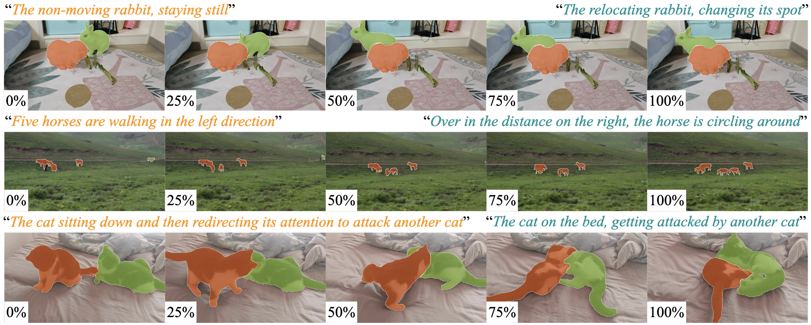

## 1st Place Solution for MeViS Track in CVPR 2024 PVUW workshop: Motion Expression guided Video Segmentation

[Mingqi Gao](mingqigao.com)<sup>1,4,+</sup>, [Jingnan Luo](https://github.com/haodi19)<sup>2,+</sup>, [Jinyu Yang](https://scholar.google.com/citations?user=iq5N7JgAAAAJ&hl=en)<sup>1,\*</sup>, [Jungong Han](jungonghan.github.io)<sup>3,4</sup>, [Feng Zheng](https://faculty.sustech.edu.cn/?tagid=fengzheng&lang=en)<sup>1,2,*</sup>

<sup>1</sup> [Tapall.ai](tapall.ai) &nbsp; <sup>2</sup> Southern University of Science and Technology &nbsp; <sup>3</sup> University of Sheffield &nbsp; <sup>4</sup> University of Warwick

<sup>+</sup> Equal Contributions, 
<sup>\*</sup> Corresponding Authors

[Report](https://arxiv.org/pdf/2406.07043)



## :round_pushpin: Installation
We test the code in the following environments, other versions may also be compatible: Python=3.9, PyTorch=1.10.1, CUDA=11.3
```bash
pip install -r requirements.txt
pip install 'git+https://github.com/facebookresearch/fvcore' 
pip install -U 'git+https://github.com/cocodataset/cocoapi.git#subdirectory=PythonAPI'
cd models/ops
python setup.py build install
cd ../..
```

## :round_pushpin: Training
1. Download MUTR's checkpoint from [HERE](https://drive.google.com/file/d/1e2-BXV3HGxPxWFKO-z34PZDBShCzEmz9/view?usp=sharing) (Swin-L, joint-training on Ref-COCO series and Ref-YouTube-VOS).
2. Run following commands to fine-tune MUTR on MeViS:
```bash
python -m torch.distributed.launch --nproc_per_node 1 --master_port 10010 --use_env train.py --freeze_text_encoder --with_box_refine --binary --dataset_file mevis --epochs 2 --lr_drop 1 --resume [MUTR checkpoint] --output_dir [output path] --mevis_path [MeViS path] --backbone swin_l_p4w7
```

## :round_pushpin: Inference
Our checkpoint is available on [Google Drive](https://drive.google.com/file/d/1qaJhup2hhequeVbd-RnPlzloMfj-PNK1/view?usp=sharing).
```bash
python inference_mevis.py --with_box_refine --binary --freeze_text_encoder --output_dir [output path] --resume [checkpoint path] --ngpu 1 --batch_size 1 --backbone swin_l_p4w7 --mevis_path [MeViS path] --split valid --clip_len 30 --context_all (optional, no sampling mode)
```

## :raised_hands: Acknowledgement
The solution is based on [MUTR](https://github.com/OpenGVLab/MUTR) and [MeViS](https://github.com/henghuiding/MeViS). Thanks for the authors for their efforts.
